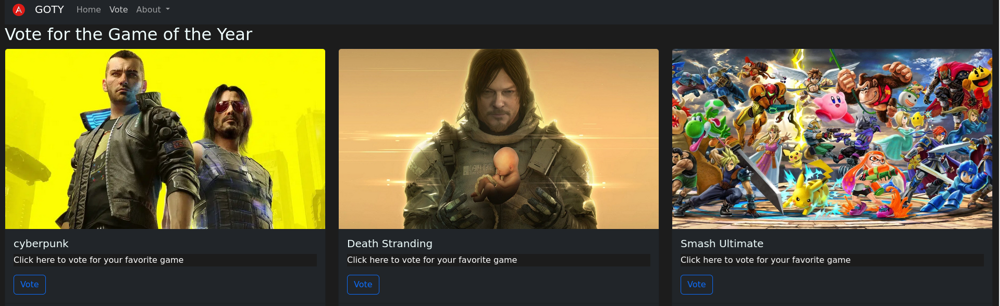
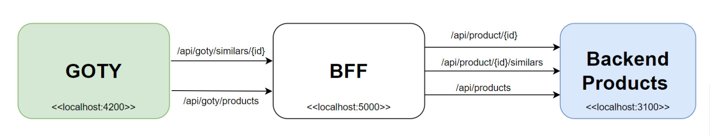

# THE GAME OF YEAR
### Kubernates Service Mesh(ISTIO)
 
-  The most important video game webpage has grown. It needs to improve its resilience and monitoring capabilities to support the vote in the most significant event to determine the best Video Game of the Year (GOTY), so it builds an online survey to determine the winner. It shows some candidates for the awards, and on the first page, it offers a bar chart with some voting trends. 

- When the application was deployed, it again has been suffering many performance issues. Currently, the technical team wants to implement Kubernetes and Service Mesh capabilities to fix the issue and improve the application's global health status. Your mission is to try to fix all of them. Are you ready to do it? Let's get into the challenge.

## THE CHALLENGE
* You will build a web service to fix the issue of the current web service. You'll have to do two endpoints: the first one will get all the games, and the second one will get the games associated with each candidate. 

 

* Your web service application needs to receive all headers that start with the pattern  **x-**, and they need to re-send it to the backend products.

## PREREQUISITES TO RUN THE PROJECT  

* ***Docker***: you need install it to deploy the proyect. 
* ***Command line***: you need it to execute the performance commands to enable the project. 

 ### Docker Commands to run project  

1. **Enable all project** 
+ docker compose up -d  backend_bff mocksserver goty-front  
2. **Disable BFF service** 
+ docker compose up -d   mocksserver goty-front   
3. **Disable Backend and Frontend** 
+ docker compose stop   mocksserver goty-front  

## FUNCTIONAL REQUIREMENTS 

* 
The main backend gets three funcionalities and you can get data across this endpoint: 

1. It gets the details by game (numbers one to six): 
 
**verb**: GET  
**end-point**: http://localhost:3100/api/product/{id}

2. It gets a list of associates' games by the candidate: 
 
**verb**: GET  
**end-point**: http://localhost:3100/api/product/{id}/similars

3. It gets a list of all games: 
 
**verb**: GET  
**end-point**: http://localhost:3100/api/products

## TECH REQUIREMENTS

1. You need to create a Docker image to deploy your web service. 
2. Create a kubernetes cluster with Minikube and deploy every component of the project; they are:  mockserver goty-front, backend-bff-solution(your own web service) and the first   backend-bff, all component will be deployed with the same file called **4-application-no-istio.yaml** 
3. Deploy istio on your Kubernetes cluster. To do it, you need to create four files: 
- 1-istio-init.yaml: Adding pre-configurations for your istio deployment
- 2-istio-minikube.yaml: Your Istio deployment
- 3-label-default-namespace
- 4-application-no-istio: all your configuration for the Kubernetes cluster. 

4. The version of Istio that is allowed are 1.20 or later. 
5. Install Kiali, Jeaguer,  and Grafana Pluggin in the cluster 
6. Create a canary deployment with Istio and Virtual service for the  backend-bff-solution(your own solution) and backend-bff
7. Create a ingress-gateway for your cluster
8. Create a circuit breaker between backend-bff-solution(your own solution) and backend-bff.
9. Clone the repository and create your own; all files should be in the folder called Kubernetes.
10. Each challenge must be implemented in its folder, located within the Kubernetes directory.
